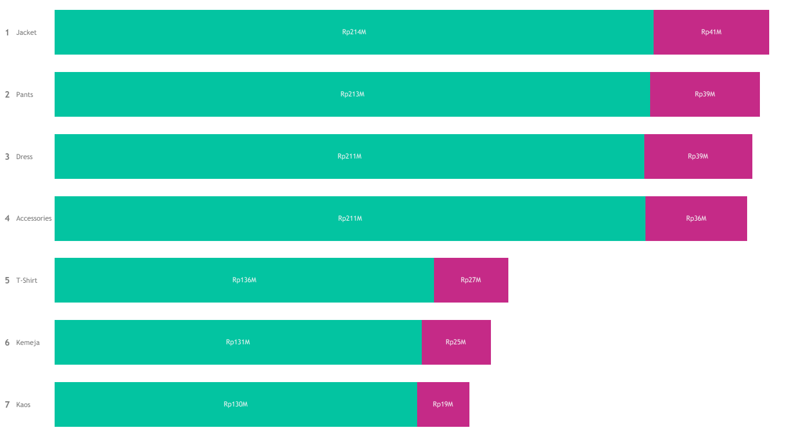

# Gayanara - Revenue Loss Analysis

> This project demonstrates an end-to-end **Data Analytics and Business Intelligence workflow**, starting from data preparation and data modeling to visualization and business insight generation.

---

## 1. Business Understanding

### 1.1 Business Background

#### Business Overview

**Gayanara** is a fictional fashion e-commerce retail business that sells a variety of fashion products through an online retail platform. As an e-commerce business, Gayanara generates revenue primarily through completed customer orders. The business operates across different product categories, customer segments, geographic regions, payment methods, and delivery channels. The business maintains several interconnected datasets covering customer information, product information, orders, order items, and customer reviews. These datasets provide an opportunity to analyze not only overall sales performance but also the portion of revenue that fails to be realized due to unsuccessful transactions.

The core business process can be illustrated as:

**Customer → Order → Order Fulfillment → Completed Transaction → Revenue**

However, not every order reaches the final stage. Some orders may be **cancelled**, while others may be **returned** after the purchase has been completed or fulfilled. These events can reduce the amount of revenue that the business ultimately realizes.

Therefore, looking only at total sales or total orders may provide an incomplete picture of business performance.

---

#### Revenue and Revenue Loss Context

For an e-commerce retailer, revenue performance is influenced not only by the number of products sold but also by the ability to successfully convert orders into realized sales.

Consider the following simplified example:

> Gayanara receives orders worth Rp1 billion during a particular period. However, Rp100 million of those orders are cancelled or subsequently returned.

Although the business initially recorded Rp1 billion in order value, not all of that value represents revenue that can ultimately be retained by the business.

This creates an important distinction between:

* **Revenue generated from successful orders**
* **Revenue associated with cancelled orders**
* **Revenue associated with returned orders**
* **Revenue that is effectively lost as a result of unsuccessful or reversed transactions**

For this project, revenue loss is specifically defined based on **cancelled and returned orders**.

The analysis therefore does not attempt to estimate future or potential sales opportunities. Instead, it focuses on **observed revenue loss within the historical transaction data**.

---

#### Why Revenue Loss Matters

Revenue loss is important because a business can experience apparently healthy sales activity while still losing a significant portion of its potential realized revenue through cancellations and returns.

For example, two product categories could generate the same gross order value:

| Category   | Order Value | Cancelled/Returned Value | Realized Revenue |
| ---------- | ----------: | -----------------------: | ---------------: |
| Category A |      Rp500M |                    Rp20M |           Rp480M |
| Category B |      Rp500M |                   Rp100M |           Rp400M |

Both categories initially generate the same order value. However, Category B experiences substantially greater revenue loss.

This means that evaluating performance solely through sales volume or gross order value could hide important operational and commercial issues.

Understanding revenue loss allows Gayanara to investigate questions such as:

* Which product categories experience the highest revenue loss?
* Which products contribute the most to cancelled and returned revenue?
* Are revenue losses concentrated in particular customer segments?
* Are certain regions associated with higher cancellation or return rates?
* Are particular payment methods associated with higher cancellation rates?
* Are specific couriers associated with higher levels of returned or cancelled orders?
* How does revenue loss change over time?
* Which areas should receive further business investigation?

The objective is therefore not simply to measure how much revenue was lost, but to understand **where the loss occurs and what characteristics are associated with it**.

---

### 1.2 Business Problem

#### Problem Statement

Gayanara currently has historical transactional data containing information about customers, products, orders, order items, and reviews. However, overall sales metrics alone do not provide sufficient visibility into the amount of revenue that fails to be realized due to **cancelled and returned orders**.

Cancelled and returned transactions represent situations where the value associated with an order does not ultimately contribute to retained sales revenue in the same way as successful orders.

If these transactions are not analyzed separately, several important business conditions may remain hidden.

For example:

* A product may have high sales but also experience a high amount of cancelled or returned revenue.
* A category may appear to perform well based on order value but have a relatively high revenue loss rate.
* A particular geographic area may generate significant revenue while also contributing disproportionately to cancelled or returned orders.
* Certain payment methods may exhibit higher cancellation rates than others.
* Certain couriers may be associated with higher return rates.
* Revenue loss may increase during particular periods even when overall sales remain stable or increase.

Therefore, Gayanara needs a structured analysis that separates **successful revenue from revenue associated with cancelled and returned orders**.

---

#### Specific Business Problem

The primary business problem addressed in this project is:

> **Gayanara lacks visibility into the magnitude, distribution, and characteristics of revenue loss resulting from cancelled and returned orders.**

The analysis focuses specifically on **actual historical revenue loss observed in the dataset**.

The project does **not** attempt to calculate potential revenue loss from:

* stockouts,
* unavailable products,
* abandoned carts,
* customer browsing behavior,
* lost sales opportunities,
* unmet demand,
* or hypothetical future purchases.

This distinction is important because those situations represent **potential or estimated revenue opportunities**, whereas cancelled and returned orders are directly observable in the available transactional data.

---

#### Revenue Loss Scope

Within this project, revenue loss is examined through two primary transaction outcomes:

##### 1. Cancelled Order Revenue

Revenue associated with orders whose status is classified as **cancelled**.

These transactions represent orders that did not proceed to a successful completed purchase.

The analysis investigates:

$$
Cancelled\ Revenue =
\sum Subtotal\ of\ Cancelled\ Order\ Items
$$

depending on the revenue definition established for the dataset.

---

##### 2. Returned Order Revenue

Revenue associated with orders whose status is classified as **returned**.

These transactions represent purchases that were subsequently returned and therefore do not represent retained sales in the same way as successfully completed orders.

The analysis investigates:

$$
Returned\ Revenue =
\sum Subtotal\ of\ Returned\ Order\ Items
$$

---

#### Core Business Impact

The business impact of this problem can be summarized as:

**Cancelled & Returned Orders**

↓

**Revenue Not Retained**

↓

**Lower Realized Revenue**

↓

**Potential Impact on Business Performance**

The purpose of the analysis is to identify where this impact is concentrated so that Gayanara can conduct targeted investigation and develop appropriate operational or commercial responses.

Importantly, the analysis identifies **patterns and associations** in the data. It does not automatically establish that a particular factor is the direct cause of cancellation or return.

For example, if one courier has a higher return rate, the analysis can identify this as a pattern requiring investigation. It should not automatically conclude that the courier caused the returns without additional evidence.

---

### 1.3 Business Objectives

The overall objective of this project is:

> **To analyze and quantify revenue loss associated with cancelled and returned orders at Gayanara, identify the segments and transaction characteristics where revenue loss is concentrated, and provide data-driven insights that can support targeted business investigation and decision-making.**

This objective can be divided into several specific objectives.

#### Objective 1 — Quantify Revenue Loss

Measure the amount of revenue associated with:

* cancelled orders,
* returned orders,
* and the combined revenue loss from both transaction outcomes.

This provides management with a clear understanding of the financial magnitude of unsuccessful or reversed transactions.

Key metrics include:

* Total Revenue
* Completed Revenue
* Cancelled Revenue
* Returned Revenue
* Total Revenue Loss
* Cancellation Rate
* Return Rate
* Revenue Loss Rate

---

#### Objective 2 — Understand Revenue Loss Trends

Analyze how cancellation, return, and revenue loss change over time.

The analysis can identify:

* periods with unusually high revenue loss,
* monthly or weekly trends,
* changes in cancellation rate,
* changes in return rate,
* and whether revenue loss is increasing or decreasing relative to overall sales.

This allows Gayanara to determine whether revenue loss is a persistent issue or concentrated within particular periods.

---

#### Objective 3 — Identify Products and Categories with High Revenue Loss

Analyze revenue loss across:

* product categories,
* sub-categories,
* brands,
* and individual products.

The objective is to identify products that:

* contribute the largest absolute amount of lost revenue,
* have high cancellation rates,
* have high return rates,
* or exhibit both high sales and high revenue loss.

This distinction is important because the product with the highest **revenue loss amount** may not necessarily have the highest **loss rate**.

For example:

> Product A may lose Rp50 million because of its large sales volume, while Product B may lose only Rp20 million but have a much higher loss rate.

Both represent different business situations and therefore require different interpretations.

---

#### Objective 4 — Identify Customer Segments Associated with Revenue Loss

Analyze revenue loss based on available customer characteristics, including:

* gender,
* age group,
* customer location,
* and other relevant customer attributes.

The objective is to determine whether revenue loss is disproportionately concentrated within particular customer segments.

This can help Gayanara identify customer groups that may require further investigation regarding their purchasing and cancellation/return behavior.

---

#### Objective 5 — Identify Geographic Patterns

Analyze revenue loss by:

* province,
* city,
* and other available geographic dimensions.

The objective is to determine whether certain geographic areas contribute disproportionately to:

* cancelled revenue,
* returned revenue,
* cancellation rate,
* return rate,
* or total revenue loss.

Geographic patterns can provide useful signals for further investigation into fulfillment, delivery, customer behavior, or market-specific conditions.

---

#### Objective 6 — Analyze Transaction and Operational Characteristics

Examine revenue loss across available transaction-related dimensions such as:

* payment method,
* courier,
* promo code,
* discount,
* and order characteristics.

The objective is to identify whether certain transaction characteristics are associated with higher cancellation or return rates.

These findings should be treated as **associations or patterns**, which can then be investigated further by the relevant business teams.

---

#### Objective 7 — Prioritize Areas for Business Investigation

The final objective is to move beyond descriptive reporting.

The analysis should help Gayanara identify:

> **Which products, categories, customer segments, regions, or transaction characteristics deserve further investigation because they contribute substantially to revenue loss?**

For example, a segment may become a priority for investigation when it combines:

* high revenue contribution,
* high cancellation/return rate,
* and high absolute revenue loss.

This approach helps management focus attention on areas with the greatest observed impact rather than treating every segment equally.

---

#### Objective 8 — Develop Actionable Business Recommendations

Based on the identified patterns, the project aims to provide recommendations that can support areas such as:

* order management,
* product management,
* customer experience,
* payment operations,
* fulfillment,
* delivery management,
* and promotional strategy.

Recommendations will be based on observed patterns in the historical data and should serve as a basis for further business investigation rather than being interpreted as definitive causal conclusions.

---

### 1.4 Business Questions

To achieve the objectives above, the analysis is structured around several key business questions.

#### A. Revenue Loss Overview

**BQ1. How much revenue does Gayanara lose from cancelled and returned orders?**

This establishes the overall financial magnitude of the problem.

Supporting questions:

* What is the total revenue generated?
* How much revenue comes from successful orders?
* How much revenue is associated with cancelled orders?
* How much revenue is associated with returned orders?
* What percentage of total order value is represented by revenue loss?

---

#### B. Cancellation vs Return

**BQ2. Is revenue loss primarily associated with cancellations or returns?**

This separates the two major sources of revenue loss.

The analysis compares:

* Cancelled Orders
* Returned Orders
* Cancelled Revenue
* Returned Revenue
* Cancellation Rate
* Return Rate

This helps determine whether Gayanara's observed revenue loss is more concentrated in the pre-transaction cancellation stage or the post-purchase return stage.

---

#### C. Time Trend

**BQ3. How does revenue loss change over time?**

The analysis investigates:

* monthly revenue,
* cancelled revenue,
* returned revenue,
* total revenue loss,
* cancellation rate,
* and return rate.

The objective is to identify periods in which revenue loss increases significantly and determine whether those periods coincide with changes in overall sales activity.

---

#### D. Product and Category

**BQ4. Which product categories contribute the most to revenue loss?**

This identifies categories with the largest absolute cancelled and returned revenue.

---

**BQ5. Which products have the highest cancellation and return rates?**

This provides a relative perspective rather than focusing only on absolute revenue.

---

**BQ6. Which products combine high revenue contribution with high revenue loss?**

This question is particularly important for prioritization.

A product with:

* high sales,
* high cancelled/returned revenue,
* and a high loss rate

may represent a more significant business concern than a low-revenue product with a high loss rate.

---

#### E. Customer

**BQ7. Which customer segments contribute the most to revenue loss?**

The analysis can examine revenue loss across:

* age groups,
* gender,
* customer location,
* and other available customer attributes.

---

**BQ8. Are cancellation and return rates significantly different across customer segments?**

This investigates whether certain customer groups exhibit different transaction outcomes.

The purpose is not to label a particular customer group as problematic, but to identify patterns that may warrant further investigation.

---

#### F. Geographic

**BQ9. Which provinces and cities contribute the most to cancelled and returned revenue?**

This identifies geographic concentration of revenue loss.

---

**BQ10. Which geographic areas have high revenue contribution but also high revenue loss rates?**

This is useful for prioritization because a high-loss area may also represent an important revenue market.

---

#### G. Payment and Operational Factors

**BQ11. Which payment methods are associated with higher cancellation rates?**

This examines whether cancellation behavior differs across payment methods.

---

**BQ12. Which couriers are associated with higher return rates?**

This identifies potential operational patterns related to delivery channels.

The analysis does not assume that the courier is the cause of the return. Instead, the result can indicate where further operational investigation may be necessary.

---

#### H. Promotion and Discount

**BQ13. How does revenue loss vary across promotional or discount usage?**

This examines whether orders using certain promotional mechanisms exhibit different cancellation or return patterns.

Relevant metrics include:

* Orders with promo codes
* Orders without promo codes
* Discount amount
* Discount rate
* Cancellation rate
* Return rate
* Revenue loss

---

#### I. Prioritization

**BQ14. Which segments should Gayanara prioritize for further investigation?**

The final question combines the findings from the previous analyses.

Potential prioritization dimensions include:

* absolute revenue loss,
* revenue loss rate,
* revenue contribution,
* cancellation rate,
* return rate,
* and transaction volume.

The purpose is to identify areas where revenue loss is both **material and concentrated**, allowing business teams to focus their investigation and improvement efforts.

---


## 2. Dataset Overview

This project uses an open source datasets that represents an electronic retail company. The datasets contains 3 main part with different file extension, Sales.csv, Product.txt, and Country.txt.


---

## 3. Data Preparations

Raw data was prepared using **Power Query** in **Power BI** to ensure data quality and consistency before the analysis and visualization stages.

The data preparation process included:
- Data type validation - ensuring dates, numerical values, and categorical fields assigned appropriate data types.
- Data cleaning - identifying and handling missing, inconsistent, or invalid values.
- Column transformation - formatting and transforming existing fields to make them suitable for analysis.
- Data standardization - ensuring consistent values across categorical fields such as product categories, sales channels, and countries.
- Data validation - checking the transformed dataset to ensure that the resulting data was consistent and ready for modeling.
- Data preperation for modeling - structuring the cleaned dataset as the foundation for the subsequent data modeling and dashboard development stages.

For **Country** dataset, since it is in a .txt file without delimiters, it must first be converted using **Python** before undergoing data cleaning with **Power Query**.
This is the code to convert the **Country** dataset from .txt file to csv file:

```python
import pandas as pd

def preprocess():
    with open(file) as file:
        content = file.readlines()

    content = [line.strip() for line in content]
    content = [line.split() for line in content]

    storekeys = [line[0] for line in content][1:]

    countries = [
        " ".join(line[1:3])
        if line[1]  == "United" else line[1] 
        for line in content
        ][1:]

    states = [
        " ".join(line[3:])
        if line[1]  == "United" else " ".join(line[2:]) 
        for line in content
        ][1:]

    data = {
        "id":storekeys,
        "country": countries,
        "states": states
    }

    df = pd.DataFrame(data)
    df.to_csv("store.csv", index=False)
```
---

## 4. Data Modeling

The dataset was structured using a **dimensional data model** based on the **Star Schema** approach in Power BI. The model separates transactional data from descriptive attributes, allowing the dashboard to perform analysis across different business dimensions such as products, stores, and time.

The data model consists of:

- **Fact Table:** `Sales`
- **Dimension Tables:** `Products`, `Store`, and `Calendar`
- **Measure Table:** `Measure`


---

### 4.1 Fact Table - Sales
The **Sales** table serves as the central fact table of the model. It contains transactional-level sales records and the foreign keys required to connect each transaction to the corresponding dimensions.

| Column          | Description                                                  |
| --------------- | ------------------------------------------------------------ |
| `Sales Key`     | Unique identifier for each sales record                      |
| `Order Number`  | Identifier of the customer order                             |
| `Line Item`     | Identifies individual line items within an order             |
| `Order Date`    | Date when the order was placed                               |
| `Delivery Date` | Date when the order was delivered                            |
| `CustomerKey`   | Identifier linking sales transactions to customers           |
| `ProductKey`    | Foreign key linking transactions to the `Products` dimension |
| `StoreKey`      | Foreign key linking transactions to the `Store` dimension    |
| `Quantity`      | Number of products sold                                      |
| `Currency Code` | Currency associated with the transaction                     |

The Sales table acts as the many-side (*) of the relationships with the dimension tables because multiple sales transactions can belong to the same product, store, or date.

---

### 4.2 Dimension Table
#### 4.2.1 Products
The Products table contains descriptive information about the products sold by the company.
Important attributes include:

- ProductKey
- Product Name
- Brand
- Category
- CategoryKey
- Subcategory
- SubcategoryKey
- Color
- Unit Cost USD
- Unit Price USD

This dimension enables product-oriented analysis, such as:

- Revenue by category
- Revenue by product
- Revenue by brand
- Product performance
- Profitability by category or subcategory

Using a separate product dimension also prevents repetitive product descriptions from being stored in every transactional record.

---

#### 4.2.2 Store

The Store table contains descriptive information about the store or sales location associated with each transaction.

The table contains attributes such as:

- id
- country
- states
- IsOnline

These attributes allow the dashboard to analyze sales performance across different geographical and sales-channel dimensions.

For example, the IsOnline attribute can be used to distinguish between online and offline transactions, while country and states support geographical analysis.

---

#### 4.2.3 Calendar

The Calendar table serves as the date dimension of the model. Rather than relying directly on the date column in the Sales fact table for time-based analysis, a dedicated calendar table provides a consistent structure for temporal analysis and Power BI time-intelligence calculations.

The table contains fields such as:

- Date
- Day Name
- Month Name
- Quarter
- Week of Month
- Week of Year
- Year

---

### 4.3 Measure Table

The Measure table is a dedicated table used to organize and store DAX measures separately from the underlying data tables.

The current model contains measures such as:

- Revenue
```DAX
Revenue = SUMX(Sales, Sales[Quantity] * RELATED(Products[Unit Price USD]))
```
- Profit
```DAX
Profit = SUMX(Sales, Sales[Quantity] * (RELATED(Products[Unit Price USD]) - RELATED(Products[Unit Cost USD])))
```
- Moving Average (25 Days)
```DAX
Moving Average (25 Days) = 
AVERAGEX(
    DATESINPERIOD(
        'Calendar'[Date],
        MAX('Calendar'[Date]),
        -25,
        DAY
    ),
    [Profit]
)
```

These measures are not stored as physical columns in the transactional data. Instead, they are calculated dynamically using DAX based on the current filter context.

---

### 4.4 Relationships

The model uses one-to-many (1:*) relationships, where dimension tables represent the "one" side and the Sales fact table represents the "many" side.

| Dimension  | Key          | Fact Table Key | Cardinality | Purpose                       |
| ---------- | ------------ | -------------- | ----------- | ----------------------------- |
| `Store`    | `id`         | `StoreKey`     | 1:*         | Store & geographical analysis |
| `Products` | `ProductKey` | `ProductKey`   | 1:*         | Product analysis              |
| `Calendar` | `Date`       | `Order Date`   | 1:*         | Time-based analysis           |

---

## 5. Dashboard Overview


## 6. Key Findings

### Finding 1 - Profitability reached a major peak around early 2020


**Insight:**  
The company experienced a clear improvement in its underlying profitability from **2016** through **2019**, with the **20-day moving average** indicating a progressively higher profit baseline. However, daily profit remained highly volatile, with several significant spikes suggesting that profitability was influenced by short-term business events or changes in sales mix. Profitability reached its highest observed level around early **2020**, followed by a sustained decline in the underlying profit trend throughout much of **2020**. A modest recovery became visible entering 2021, although profitability had not returned to its previous peak.

**Why It Matters:**  
This pattern indicates that the company's profitability has not been constant over time and that the period around the **2020** peak represents an important performance inflection point. For management, the key issue is not simply identifying high- or low-profit days, but understanding the business drivers behind changes in the underlying profitability trend. Further analysis should connect profit movements with revenue, product mix, sales channels, geography, transaction volume, and promotional activity to determine whether changes in profitability were driven by sales growth, category mix, channel performance, or other operational factors.

---

### Finding 2 - Revenue is strongly concentrated in a small number of product categories



| Category                      | Revenue  | Profit Margin |
| ------------------------------| ---------| --------------|
| Computers                     | $19.30 M | 58.4%        |
| Home Appliances               | $10.80 M | 58.3%        |
| Cameras and camcorders        | $6.52 M  | 60.1%        |
| Cell phones                   | $6.18 M  | 56.6%        |
| TV and Video                  | $5.93 M  | 59.7%        |
| Audio                         | $3.17 M  | 57.7%        |
| Music, Movies and Audio Books | $3.13 M  | 61.0%        |
| Games and Toys                | $0.72 M  | 54.7%        |


**Insight:**   
`Computers` is the largest revenue contributor at **$19.30M (34.6%)**, followed by `Home Appliances` at **$10.80M (19.4%)**. Together, these two categories account for approximately **54%** of total revenue, indicating that overall sales performance is highly influenced by their performance. Meanwhile, `Cameras and camcorders`, `Cell phones`, and `TV and Video` each contribute approximately **10–12%**, providing additional but smaller revenue streams. At the lower end, Games and Toys contributes only **1.3%**, making it the smallest revenue-generating category.

Profit margins across product categories range from **54.7% to 61.0%**, indicating relatively consistent profitability across the portfolio. `Music, Movies and Audio Books` records the highest margin at **61.0%**, followed by `Cameras and camcorders` at **60.1%** and `TV and Video` at **59.7%**. Meanwhile, `Games and Toys` has the lowest margin at **54.7%**.


**Why it matters**:   
`Computers` and `Home Appliances` represents significant source of both revenue and profit. Together these categories contributes a substantial portion of the company's overall financial performance. Because a substantial portion of company revenue and estimated profit comes from these categories, changes in its sales performance can have a meaningful impact on overall business results. From a business perspective, management needs to monitor these categories not only in terms of sales growth but also margin stability, inventory availability, product mix, and demand trends to ensure that growth does not come at the expense of profitability.

On the other hand, the revenue distribution suggests that management should simultaneously protect the performance of the company's major revenue drivers while investigating growth opportunities and underlying performance factors in lower-contributing categories.

The high profit margin of `Music, Movies and Audio Books` indicates that the category generates a relatively large amount of profit from each dollar of revenue. However, its relatively small revenue contribution limits its impact on the company's total profit. From a business perspective, this creates a potential growth opportunity. If the company can increase sales in this category while maintaining its current margin level, the category could make a larger contribution to overall profitability. Management could therefore investigate whether the category's relatively low revenue is driven by limited product assortment, lower customer demand, distribution reach, or sales volume.

The low contribution of `Games and Toys` to both revenue and profit margin creates a need to understand the underlying causes of the category's performance before deciding how it should be managed. If the performance is caused by limited demand, the company may need to reconsider its product strategy. If it is caused by limited assortment, distribution, or promotional exposure, there may be opportunities to improve performance. The key business consideration is therefore whether the category represents a growth opportunity or a relatively low-priority segment based on its potential and underlying economics.

---

### Finding 3 - The channel mix indicates different roles within the revenue portfolio


**Insight:**   
The `Offline` sales is the company's dominant revenue channel, generating approximately **$44.35M** or **79.5%** of total revenue, compared with **$11.40M** or **20.5%** from `online` transactions. This means the company currently relies heavily on its `offline` channel as its primary revenue engine, with `offline` revenue approximately 3.9 times larger than `online` revenue.

**Why It Matters**:   
The strong concentration of revenue in the `offline` channel means that `offline` performance has a substantially greater impact on the company's overall financial performance. A **10%** change in `offline` revenue would represent approximately **$4.44M**, compared with **$1.14M** for an equivalent change in `online` revenue. At the same time, the **$11.40M** contribution from `online` transactions indicates that digital sales already represent a meaningful component of the company's revenue portfolio. Therefore, channel performance should be evaluated not only based on revenue contribution, but also in terms of profitability, customer behavior, transaction volume, and operating economics to understand the role and business value of each channel.

---

### Finding 4 - The United States is the dominant profit market


**Insight:**   
The company generated approximately **$25.99M** in profit across eight countries, with `the United States` contributing **$13.92M** or **53.6%** of total profit. This makes the `US` the company's dominant geographic profit engine and indicates a significant concentration of profitability in a single market. The `United Kingdom`, `Germany`, and `Canada` form a meaningful secondary profit base, collectively contributing approximately **30.6%** of total profit. Meanwhile, `Australia`, `Italy`, `the Netherlands`, and `France` each contribute less than **5%** individually.

Profit margins across the eight markets are remarkably consistent, ranging from **58.26%** in `Canada` to **59.24%** in `Australia`, representing a relatively narrow spread of approximately **0.98** percentage points. `Australia` records the highest observed profit margin at **59.24%**, followed by France at **58.98%** and `the Netherlands` at **58.93%**. Meanwhile, `Canada` records the lowest margin at **58.26%**. Despite these differences, the relatively narrow margin range indicates that geographic differences in absolute profit are not primarily explained by substantial variations in margin. This becomes particularly evident when comparing `the United States` and `Australia`. `The United States` generates approximately **$13.92M** in profit, compared with **$1.24M** in `Australia`, despite their margins being relatively close at **58.58%** and **59.24%**, respectively. This suggests that business scale and revenue volume play a much larger role in determining absolute profit contribution than small differences in margin.

**Why It Matters:**   
The concentration of profit in the `United States` means that its performance has a substantial impact on overall company profitability. At the same time, absolute profit alone does not indicate market efficiency or growth potential. Further analysis combining country, revenue, profit margin, product category, channel, and time trends is required to understand the underlying drivers of geographic profitability.

---

## 7. Strategic Recommendations

### 7.1 Product Category Strategy

1. `Computers` and `Home Appliances` should remain key priorities because they collectively generate approximately **54% of total revenue** and represent a substantial share of estimated profit. Management should focus on maintaining product availability, optimizing inventory, monitoring product-level profitability, and developing targeted promotions. Because of their large revenue base, relatively small improvements in these categories can have a meaningful impact on overall business performance. For example, a **10%** increase in Computers revenue at the current margin would represent approximately **$1.93M in additional revenue** and around **$1.13M in additional profit**.

2. `Cameras and camcorders`, `TV and Video`, and `Music, Movies and Audio Books` demonstrate relatively strong profit margins. The company should explore opportunities to increase their revenue contribution through broader product assortment, targeted marketing, cross-selling, product bundling, and improved channel exposure while maintaining margin discipline. The objective is to convert strong category-level profitability into greater absolute profit contribution.

3. `Cell Phones` generates approximately **$6.18M in revenue** but has a comparatively lower profit margin of **56.58%**. Rather than focusing exclusively on increasing sales volume, management should investigate pricing, discounting, product mix, and brand-level profitability. Cross-selling accessories and complementary products can also increase revenue and profit per transaction. A 1 percentage-point improvement in margin on the current revenue base would represent approximately **$61.8K in additional profit**, assuming revenue remains constant.

4. `Games and Toys` has the lowest revenue and lowest profit margin in the sales portfolio. Before making major portfolio decisions, management should investigate the underlying drivers of its performance, including sales volume, SKU availability, pricing, promotional exposure, inventory turnover, and seasonality. The objective is to determine whether the category represents an opportunity for improvement or should receive a lower level of strategic investment.

5. The company can increase customer basket value by creating complementary product bundles across categories. This strategy can increase revenue per transaction while reducing reliance on customer acquisition as the sole driver of revenue growth. Examples include:

    - Computers + accessories
    - Smartphones + accessories
    - TVs + audio equipment
    - Cameras + memory cards and accessories

---

### 7.2 Sales Channel Strategy

The company's revenue is currently highly concentrated in the offline channel, which contributes approximately 79.5% of total revenue, while the online channel contributes 20.5%. Therefore, the strategic priority should not be to replace the offline channel with online, but to protect the existing offline revenue base while developing online as a scalable growth channel.

1. The company should protect and optimize its offline revenue engine because changes in offline performance have a substantially larger impact on total revenue. Operational initiatives should focus on maintaining store productivity, product availability, customer experience, and performance across locations.

2. The company should develop the online channel as a growth engine. With approximately $11.40M in revenue, online sales already represent a meaningful part of the business and provide a foundation for further digital growth. However, online expansion should be evaluated based on profitability and customer economics rather than revenue growth alone.

3. The company should adopt an omnichannel strategy that connects online and offline customer journeys. Initiatives such as Click & Collect, Ship From Store, unified loyalty programs, online-to-offline engagement, and offline-to-online customer acquisition can allow both channels to complement rather than compete with each other.

4. Management should establish channel-level performance monitoring covering revenue, profit, margin, AOV, customer acquisition cost, conversion rate, repeat purchase, and customer lifetime value. This would enable the company to distinguish genuine incremental online growth from revenue that is simply shifting from offline to online.

---

### 7.3 Geographic Strategy

Geographic strategy should focus on protecting the United States as the company's core profit engine while developing secondary markets through sustainable, margin-conscious growth. Given the relatively narrow 58–59% profit margin range across countries, differences in absolute profit appear to be driven more by business scale than by major margin variations. Therefore, management should prioritize profitable revenue growth, maintain margin discipline, investigate the drivers behind high-margin markets such as Australia, France, and the Netherlands, and strengthen the performance of meaningful secondary markets such as the UK, Germany, and Canada.

---
