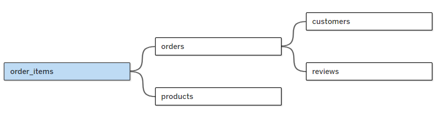
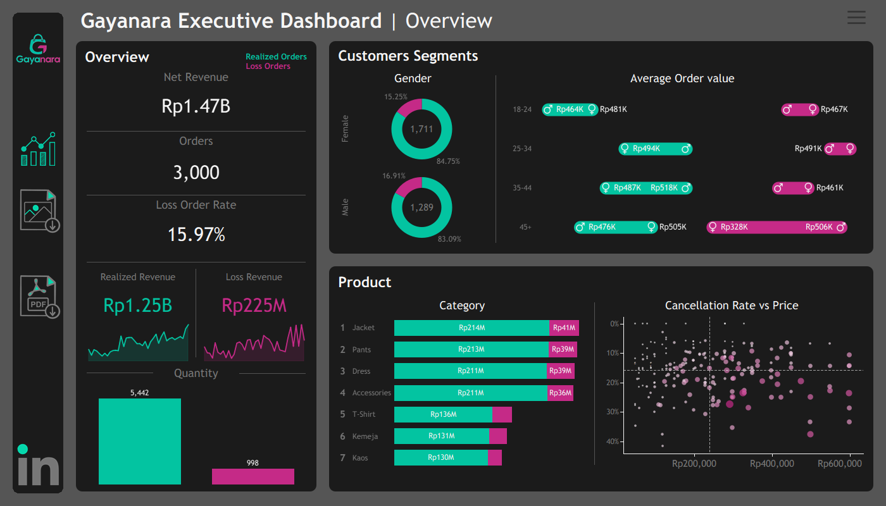
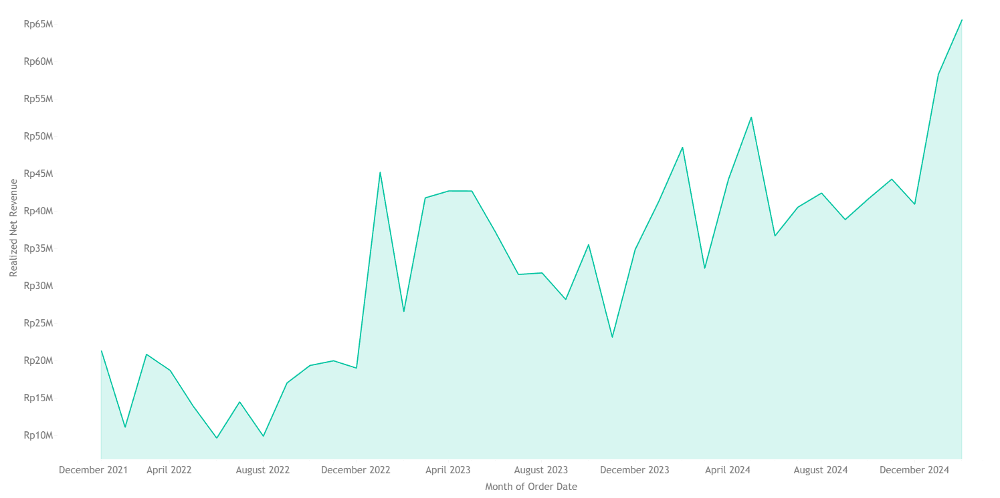
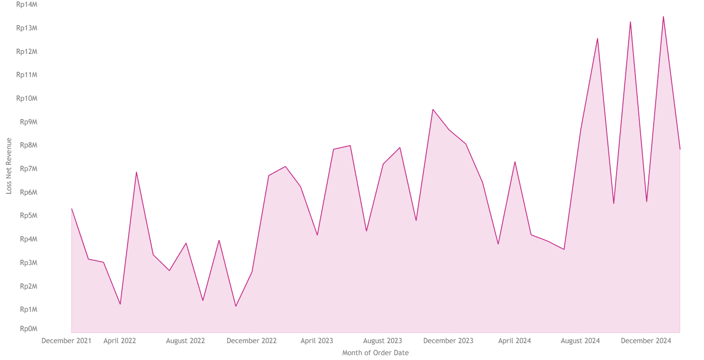
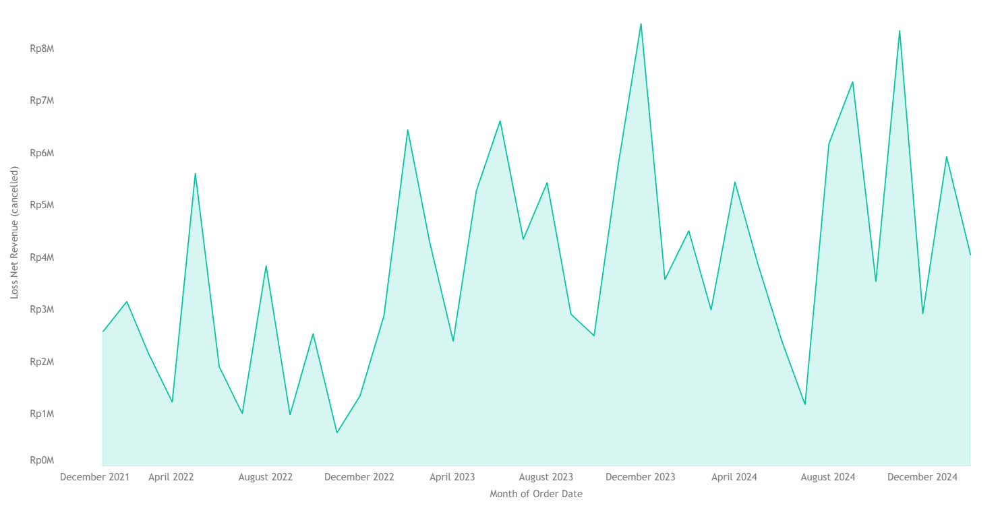
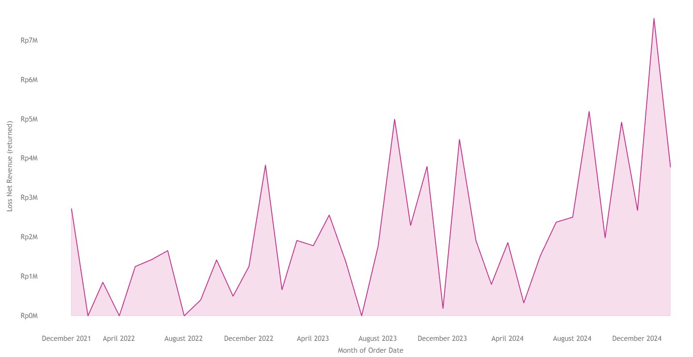

# Gayanara - Revenue Loss Analysis

> This project demonstrates an end-to-end **Data Analytics and Business Intelligence workflow**, starting from data preparation and data modeling to visualization and business insight generation.

---

## 1. Business Understanding

### 1.1 Business Background

#### Business Overview

**Gayanara** is a fictional fashion e-commerce retail business that sells a variety of fashion products through an online retail platform. As an e-commerce business, Gayanara generates revenue primarily through completed customer orders. The business operates across different product categories, customer segments, geographic regions, payment methods, and delivery channels. The business maintains several interconnected datasets covering customer information, product information, orders, order items, and customer reviews. These datasets provide an opportunity to analyze not only overall sales performance but also the portion of revenue that fails to be realized due to unsuccessful transactions. The core business process can be illustrated as:

**Customer → Order → Order Fulfillment → Completed Transaction → Revenue**

However, not every order reaches the final stage. Some orders may be **cancelled**, while others may be **returned** after the purchase has been completed or fulfilled. These events can reduce the amount of revenue that the business ultimately realizes. Therefore, looking only at total sales or total orders may provide an incomplete picture of business performance.

#### Revenue and Revenue Loss Context

For an e-commerce retailer, revenue performance is influenced not only by the number of products sold but also by the ability to successfully convert orders into realized sales.

Consider the following simplified example:

> Gayanara receives orders worth Rp1 billion during a particular period. However, Rp100 million of those orders are cancelled or subsequently returned.

Although the business initially recorded Rp1 billion in order value, not all of that value represents revenue that can ultimately be retained by the business.

This creates an important distinction between:

* **Revenue generated from successful orders**
* **Revenue associated with cancelled orders**
* **Revenue associated with returned orders**
* **Revenue that is effectively lost as a result of unsuccessful or reversed transactions**

For this project, revenue loss is specifically defined based on **cancelled and returned orders**.

#### Why Revenue Loss Matters

Revenue loss is important because a business can experience apparently healthy sales activity while still losing a significant portion of its potential realized revenue through cancellations and returns.

For example, two product categories could generate the same gross order value:

| Category   | Order Value | Cancelled/Returned Value | Realized Revenue |
| ---------- | ----------: | -----------------------: | ---------------: |
| Category A |      Rp500M |                    Rp20M |           Rp480M |
| Category B |      Rp500M |                   Rp100M |           Rp400M |

Both categories initially generate the same order value. However, Category B experiences substantially greater revenue loss. This means that evaluating performance solely through sales volume or gross order value could hide important operational and commercial issues.

---

### 1.2 Business Problem

#### Problem Statement

Gayanara currently has historical transactional data containing information about **customers**, **products**, **orders**, **order items**, and **reviews**. However, overall sales metrics alone do not provide sufficient visibility into the amount of revenue that fails to be realized due to **cancelled and returned orders**. Cancelled and returned transactions represent situations where the value associated with an order does not ultimately contribute to retained sales revenue in the same way as successful orders. If these transactions are not analyzed separately, several important business conditions may remain hidden.

#### Specific Business Problem

The primary business problem addressed in this project is:

> **Gayanara lacks visibility into the magnitude, distribution, and characteristics of revenue loss resulting from cancelled and returned orders.**

The analysis focuses specifically on **actual historical revenue loss observed in the dataset**. This distinction is important because those situations represent **potential or estimated revenue opportunities**, whereas cancelled and returned orders are directly observable in the available transactional data.

#### Revenue Loss Scope

Within this project, revenue loss is examined through two primary transaction outcomes:

##### 1. Cancelled Order Revenue

Revenue associated with orders whose status is classified as **cancelled**. These transactions represent orders that did not proceed to a successful completed purchase. The analysis investigates:

$$
Cancelled\ Revenue =
\sum Subtotal\ of\ Cancelled\ Order\ Items
$$

depending on the revenue definition established for the dataset.

##### 2. Returned Order Revenue

Revenue associated with orders whose status is classified as **returned**. These transactions represent purchases that were subsequently returned and therefore do not represent retained sales in the same way as successfully completed orders. The analysis investigates:

$$
Returned\ Revenue =
\sum Subtotal\ of\ Returned\ Order\ Items
$$

---

### 1.3 Business Objectives

The overall objective of this project is:

> **To analyze and quantify revenue loss associated with cancelled and returned orders at Gayanara, identify the segments and transaction characteristics where revenue loss is concentrated, and provide data-driven insights that can support targeted business investigation and decision-making.**

This objective can be divided into several specific objectives.

#### Objective 1 - Understand Revenue Loss Trends

Analyze how cancellation, return, and revenue loss change over time. This allows Gayanara to determine whether revenue loss is a persistent issue or concentrated within particular periods. The analysis can identify:

* periods with unusually high revenue loss,
* monthly or weekly trends,
* changes in cancellation rate,
* changes in return rate,
* and whether revenue loss is increasing or decreasing relative to overall sales.

#### Objective 2 - Identify Products and Categories with High Revenue Loss

Analyze revenue loss across:

* product categories,
* sub-categories,
* brands,
* and individual products.

The objective is to identify products that:

* contribute the largest absolute amount of lost revenue,
* have high cancellation rates,
* have high return rates,
* or exhibit both high sales and high revenue loss.

#### Objective 3 - Identify Customer Segments Associated with Revenue Loss

Analyze revenue loss based on available customer characteristics, including:

* gender,
* age group,
* customer location,
* and other relevant customer attributes.

The objective is to determine whether revenue loss is disproportionately concentrated within particular customer segments. This can help Gayanara identify customer groups that may require further investigation regarding their purchasing and cancellation/return behavior.

#### Objective 4 — Identify Geographic Patterns

Analyze revenue loss by:

* province,
* city,
* and other available geographic dimensions.

The objective is to determine whether certain geographic areas contribute disproportionately to:

* cancelled revenue,
* returned revenue,
* cancellation rate,
* return rate,
* or total revenue loss.

Geographic patterns can provide useful signals for further investigation into fulfillment, delivery, customer behavior, or market-specific conditions.

### 1.4 Business Questions

To achieve the objectives above, the analysis is structured around several key business questions.

1. How much revenue does Gayanara lose from cancelled and returned orders?
2. Is revenue loss primarily associated with cancellations or returns?
3. How does revenue loss change over time?
4. Which product categories contribute the most to revenue loss?
5. Which products have the highest cancellation and return rates?
6. Which products combine high revenue contribution with high revenue loss?
7. Which customer segments contribute the most to revenue loss?
8. Are cancellation and return rates significantly different across customer segments?
9. Which provinces and cities contribute the most to cancelled and returned revenue?
10. Which geographic areas have high revenue contribution but also high revenue loss rates?
11. Which payment methods are associated with higher cancellation rates?

---

## 2. Data Preparation

### 2.1 Data Overview

The Gayanara Revenue Loss Analysis project uses five interconnected datasets representing different aspects of the e-commerce business:

| Dataset         | Role      | Description                                                        | Key Identifier                                       |
| --------------- | --------- |------------------------------------------------------------------- | ---------------------------------------------------- |
| **customers**   | Dimension | Customer demographic and registration information                  | `customer_id`                                        |
| **products**    | Dimension | Product attributes, pricing, inventory, and product classification | `product_id`                                         |
| **orders**      | Dimension | Order-level transaction and operational information                | `order_id`                                           |
| **order_items** | Fact      | Product-level details for each order                               | `item_id`, `order_id`, `product_id`                  |
| **reviews**     | Dimension | Customer reviews and ratings associated with products and orders   | `review_id`, `order_id`, `product_id`, `customer_id` |

---

### 2.2 Data Preparation Objectives

The data preparation process is performed to ensure that the datasets are suitable for reliable analysis and visualization.

The main objectives are to:

1. Ensure data quality by identifying and handling missing, inconsistent, or invalid values.
2. Standardize data types and formats so that numerical, categorical, and date fields can be analyzed correctly.
3. Validate key identifiers and relationships between tables.
4. Prevent duplicate records from distorting revenue calculations.
5. Establish consistent definitions for revenue, cancelled orders, returned orders, and revenue loss.
6. Create analytical fields required for KPI calculations.
7. Prepare a relational data structure that can be efficiently connected in Tableau.
8. Ensure that the final dataset accurately represents the business logic defined during the Business Understanding stage.

---

### 2.3 Data Profiling

Before performing transformations, the datasets are profiled to understand their structure, quality, and relationships.

The profiling process examines:

* Number of rows and columns
* Column names and data types
* Missing values
* Duplicate records
* Unique values
* Value distributions
* Minimum and maximum values
* Potentially invalid values
* Primary key uniqueness
* Foreign key consistency
* Relationships between tables

This stage is important because data quality issues identified early can prevent inaccurate revenue calculations later in the analysis.

---

#### 2.3.1 Customers Table

The `customers` table contains:

* `customer_id`
* `name`
* `email`
* `phone`
* `city`
* `province`
* `registration_date`
* `gender`
* `age_group`

The preparation focuses on ensuring that:

* `customer_id` is unique.
* `Customer` identifiers are not missing.
* `registration_date` is stored as a valid date.
* `gender` values are consistently formatted.
* `age_group` values follow a consistent classification.
* `City` and `province` names use consistent formatting.
* Duplicate `customer` records are identified and investigated.

The `customer_id` serves as the primary key for connecting customers to their orders.

---

#### 2.3.2 Products Table

The `products` table contains:

* `product_id`
* `name`
* `sub_category`
* `price_idr`
* `stock`
* `brand`
* `avg_rating`
* `category`
* `material`

The preparation focuses on ensuring that:

* `product_id` is unique.
* `price_idr` is stored as a numeric field.
* `stock` is stored as a numeric field.
* `avg_rating` is stored as a numeric field.
* `Category` and `sub_category` values are standardized.
* `Brand` names are consistently formatted.
* `Product` names are checked for duplicates or inconsistent representations.
* Negative or otherwise invalid numerical values are investigated.

The `product_id` serves as the primary key used to connect product information to `order_items`.

---

#### 2.3.3 Orders Table

The `orders` table is the main order-level transactional dataset.

It contains:

* `order_id`
* `customer_id`
* `order_date`
* `total_amount_idr`
* `shipping_city`
* `shipping_province`
* `shipping_cost_idr`
* `payment_method`
* `order_status`
* `promo_code`
* `courier`
* `discount_amount_idr`

The preparation of this table is particularly important because `order_status` determines whether an order contributes to realized revenue or revenue loss.

The preparation focuses on ensuring that:

* `order_id` should uniquely identify each order
* `customer_id` Each order should be associated with a valid customer
* `order_date` field is converted into a valid date format
* Standardize `order_status` values are reviewed and standardized to ensure consistent classification
* `total_amount_idr`, `shipping_cost_idr`, and `discount_amount_idr` are checked for appropriate numeric data types
* Categorical fields such as `payment_method`, `promo_code`, `courier`, `shipping_city`, and `shipping_province` are standardized to ensure that differences in capitalization, spacing, or naming do not create artificial categories

---

#### 2.3.4 Order Items Table

The `order_items` table provides the product-level details of each transaction., it contains:

* `item_id`
* `order_id`
* `product_id`
* `quantity`
* `unit_price_idr`
* `subtotal_idr`

This table is particularly important for calculating product-level revenue and revenue loss.

The preparation focuses on ensuring that:

* Each `item_id` should uniquely identify an order_item record
* Every `order_id` in `order_items` should correspond to an order in the `orders` table
* Every `product_id` in `order_items` should correspond to a valid product in the `products` table
* The `quantity` field is checked to ensure that values are numeric and logically valid
* `unit_price_idr` is checked to ensure that it contains valid numeric values.
* `sub_total_idr` field is checked to ensure that values are numeric and logically valid. The validated `subtotal_idr` is then used as the primary basis for product-level revenue analysis where appropriate.

---

#### 2.3.5 Reviews Table

The `reviews` table contains:

* `review_id`
* `order_id`
* `product_id`
* `customer_id`
* `rating`
* `review_text`
* `review_date`
* `helpful_count`

Although reviews are not the primary source for revenue calculation, they can provide additional context for investigating product performance.

The preparation includes:

* Validating unique `review_id`
* Validating `order_id`
* Validating `product_id`
* Validating `customer_id`
* Standardizing `rating`
* Converting `review_date` to a valid date
* Checking missing values
* Checking rating ranges
* Identifying duplicate reviews

---

### 2.4 Handling Missing Values

Missing values are assessed according to their business meaning rather than automatically removed.

Different fields require different approaches.

For example:

* A missing `promo_code` may represent an order without a promotion rather than missing information.
* A missing `phone` number may not affect revenue analysis.
* A missing `customer_id` in an order may represent a referential integrity issue.
* A missing `product_id` in `order_items` may prevent product-level analysis.
* A missing `order_status` can significantly affect revenue classification and therefore requires investigation.

Therefore, missing-value treatment is determined based on the analytical role of each field.

This prevents unnecessary deletion of valid business records while protecting critical calculations from incomplete data.

---

### 2.5 Handling Duplicate Records

Duplicate records are investigated at both the table and transaction levels.

The primary keys used for validation include:

| Table       | Primary Key   |
| ----------- | ------------- |
| Customers   | `customer_id` |
| Products    | `product_id`  |
| Orders      | `order_id`    |
| Order Items | `item_id`     |
| Reviews     | `review_id`   |

Duplicates are particularly important in the `orders` and `order_items` tables because duplicate transactions could result in overstated revenue.

The objective is not simply to remove every repeated value, because repeated `order_id` values in `order_items` are expected when one order contains multiple products.

For example:

```text
order_id = 1001
    ├── Product A
    ├── Product B
    └── Product C
```

This is a valid one-to-many relationship rather than duplicate data.

Therefore, duplicate detection is performed based on the appropriate grain of each table.

---

### 2.6 Data Type Standardization

Consistent data types are established before analysis.

#### Date fields

Converted to date format:

* `registration_date`
* `order_date`
* `review_date`

#### Numeric fields

Converted to numeric format:

* `price_idr`
* `stock`
* `avg_rating`
* `total_amount_idr`
* `shipping_cost_idr`
* `discount_amount_idr`
* `quantity`
* `unit_price_idr`
* `subtotal_idr`
* `rating`
* `helpful_count`

#### Categorical fields

Standardized as dimensions:

* `gender`
* `age_group`
* `category`
* `sub_category`
* `brand`
* `material`
* `payment_method`
* `order_status`
* `promo_code`
* `courier`
* `city`
* `province`

---

### 2.7 Data Integration

After individual tables have been cleaned and validated, the datasets are connected based on their relational keys.

The primary relationships are:



This relational structure allows transaction-level revenue loss to be analyzed against multiple business dimensions without unnecessarily duplicating data.

| Dimension       | Key          | Cardinality |
| --------------- | ------------ | ----------- |
| **customers**   | `customer_id`| 1:*         |
| **products**    | `product_id` | 1:*         | 
| **orders**      | `order_id`   | 1:*         |
| **reviews**     | `order_id`   | 1:*         |

---

## 5. Dashboard Overview

[Link to tableau dashboard](https://public.tableau.com/views/Gayanara_dashboard/Overview?:language=en-US&:sid=&:redirect=auth&:display_count=n&:origin=viz_share_link)




## 6. Key Findings

### Finding 1 - Gayanara experienced strong and sustained revenue growth throughout the observation period

Monthly Realized Revenue



Monthly Loss Revenue



**Insight 1:**   
The monthly trend shows a clear long-term growth trajectory in Gayanara's realized net revenue. Realized revenue increased from **Rp21.34 million** in **January 2022** to **Rp65.61 million** in **February 2025**, meaning the monthly realized revenue at the end of the observation period was more than three times the level recorded at the beginning of the period. The growth was not linear, however, as the business experienced considerable month-to-month fluctuations. During 2022, realized revenue generally remained below **Rp21 million per month**, with the lowest point occurring in **June 2022** at **Rp9.67 million**. Revenue then increased substantially in **2023**, reaching **Rp45.23 million** in **January 2023**, and continued to develop at a higher level throughout **2024**, when monthly realized revenue frequently exceeded **Rp40 million**. The highest monthly realized revenue was recorded in **February 2025** at **Rp65.61 million**.

**Insight 2:**   
The annual aggregation provides an important perspective that is less visible from the monthly chart. Gayanara generated approximately **Rp195.58 million** of **realized revenue** in **2022**, which increased to **Rp421.41 million** in **2023**, representing approximately **115.5% year-over-year growth**. However, revenue loss also increased substantially during the same period, from **Rp38.57 million** in **2022** to **Rp82.57 million** in **2023**, or approximately **114.1% growth**. Because realized revenue and revenue loss grew at almost the same rate, the overall revenue loss rate remained relatively stable, at approximately **16.47%** in **2022** and **16.38%** in **2023**. This suggests that the rapid expansion in business volume during 2023 was accompanied by a nearly proportional increase in revenue leakage from cancelled and returned orders.
 
This is an important indication that business growth during 2023 did not yet translate into proportional improvement in transaction efficiency. Gayanara successfully generated substantially more revenue, but the amount of revenue exposed to cancellation and return increased almost equally fast. In other words, the company was growing, but the revenue leakage mechanism was scaling alongside the business. From a management perspective, this means that simply increasing sales volume is not sufficient. If the underlying cancellation and return behavior scales proportionally with transaction volume, Gayanara may continue to lose a significant portion of the additional value generated by growth. Therefore, 2023 can be viewed as a period of strong business expansion but relatively unchanged revenue-loss efficiency.

**Insight 3:**   
The most significant development appears in **2024**. Realized revenue increased from **Rp421.41 million** in **2023** to **Rp504.59** million in 2024, representing approximately **19.7% year-over-year growth**. In contrast, revenue loss remained almost flat, increasing only slightly from **Rp82.57 million** to **Rp82.94 million**, or approximately **0.4%**. This means that Gayanara generated an additional **Rp83.18 million** of realized revenue in **2024** while the observed revenue loss increased by only approximately **Rp0.37 million**. As a result, the annual revenue loss rate declined from approximately **16.38%** in 2023 to **14.12%** in **2024**.

This is arguably the strongest positive finding in the entire trend analysis. It suggests that Gayanara's business growth in 2024 was more efficient than its growth in 2023. The company was able to generate significantly more realized revenue without experiencing a proportional increase in revenue leakage from cancelled and returned orders. Gayanara appears to be scaling faster than its revenue loss. This is desirable because it means that a larger proportion of the transaction value generated by the business was successfully converted into realized revenue. The improvement is particularly meaningful because it shows that revenue loss should not be evaluated solely by its absolute value. Although Gayanara still lost approximately **Rp82.94 million** in **2024**, the financial severity of that loss relative to the overall transaction value was lower than in **2023**.

---

### Finding 2 - Cancellations are the primary source of revenue loss, but the contribution of returns is becoming increasingly significant.

Monthly Loss Revenue from Cancelled Orders



Monthly Loss Revenue from Returnd Orders



**Insight 1:**   
Overall, between **January 2022** and **February 2025**, Gayanara recorded a total revenue loss of approximately **Rp225.42 million** due to cancelled and returned orders. Of this amount, **Rp146.79 million** (roughly **65.1%**) stemmed from **cancelled orders**, while **Rp78.63 million** (roughly **34.9%**) resulted from **returned orders**. Thus, cancellations represented the dominant source of revenue leakage overall. However, this composition did not remain constant throughout the period. In **2022**, cancellations accounted for approximately **70.2%** of the total loss, whereas returns made up only about **29.8%**. The composition remained relatively stable in **2023**, with cancellations at around **69.5%** and returns at approximately **30.5%**. By **2024**, the contribution of cancellations had dropped to **63.1%**, while returns rose to **36.9%**. In the first two months of **2025**, the pattern even reversed, returns accounted for approximately **53.2%** of the revenue loss, while cancellations accounted for about **46.8%**.

This finding shows that Gayanara's revenue leakage is not solely a cancellation problem. Although cancellations have historically been the largest source of revenue loss, returns are becoming increasingly important as a source of financial leakage. This distinction matters because cancellation and return occur at different stages of the customer journey. Cancellations generally occur before an order is successfully completed, while returns occur after the order has progressed further through fulfillment and has typically reached the customer. Therefore, the two types of loss may require different investigative approaches and corrective actions.

---

### Finding 3 - 


---

### Finding 4 - 


---

## 7. Strategic Recommendations

### 

---

### 


---

### 


---
